# Concursos Tracker

[](https://github.com/luisesantamaria/concursos-tracker/actions/workflows/ci.yml)


**Motor de dados e portal de avisos para concursos públicos e processos
seletivos no Brasil.** Descobre, verifica e monitora as fontes oficiais de
~5.570 municípios, bancas e diários — com um requisito de projeto inegociável:
**zero falsos positivos, toda afirmação rastreável até o documento oficial que
a prova.**

## Visão geral

Quem presta concurso vigia dezenas de sites de bancas, prefeituras e diários —
ou depende de agregadores incompletos, atrasados e sem link para a fonte. O
Concursos Tracker resolve o problema na camada de dados: um usuário cadastra
seu perfil (escolaridade, cidade + raio, salário mínimo) e recebe apenas os
certames elegíveis, com alertas de ciclo de vida (novo edital, retificação,
inscrições encerrando, convocação) — cada um apontando para a fonte oficial.
Um aviso errado custa uma taxa de inscrição ou uma mudança de cidade; por isso
o sistema prefere **abster-se a chutar**, e cada dado publicado carrega sua
proveniência.

## Como funciona

```mermaid
flowchart LR
    subgraph Fontes["Fontes de verdade (convergentes)"]
        B[Bancas]
        P[Prefeituras]
        D[Diários oficiais]
        R[Radares · só sinal]
    end
    Fontes --> DESC["Descoberta<br/>registro de domínios ·<br/>padrões por CMS · cascata"]
    DESC --> V2["Adjudicação V2 (IA)<br/>certificador com citações<br/>verificadas por código +<br/>fiscal adversarial + portão"]
    V2 --> REG[("Registro vivo<br/>URLs confirmadas<br/>com proveniência")]
    REG --> MON["Monitoramento<br/>diff + classificação<br/>de eventos"]
    MON --> EXT["Extração<br/>certames estruturados +<br/>resolução de identidade"]
    EXT --> API["API / Portal / Alertas"]
```



- **Fontes convergentes, não hierarquia**: a banca é a fonte mais rica do
  ciclo ativo *quando existe* (a maioria dos PSS nunca passa por banca); a
  prefeitura é o publicador legal; o diário é o registro com valor legal; os
  radares (Ache, PCI) apenas descobrem e auditam. A autoridade é atribuída
  **por tipo de fato** e as fontes se corroboram.
- **IA adjudica, código verifica**: o certificador lê a evidência congelada e
  cita trechos literais; o código verifica cada citação caractere a caractere,
  além da autoridade e identidade do domínio. Nada é publicado sem passar pelo
  portão.
- **Escala por demanda, não por força bruta**: um sinal de atividade nacional
  (Querido Diário, bancas, radares) decide *onde* e *quando* verificar —
  ~US$20/ano de inferência contra meses de backfill exaustivo.

## Status

| Fase | Escopo | Estado | Resultado-chave |
|---|---|---|---|
| F0-F1 | Modelo de autoridade · crawlers de bancas RS | ✅ | Base de certames de bancas |
| **F2** | **Descoberta municipal RS (motor V2)** | 🔄 | F2.P1-P4 concluídos; passo atual F2.P5 (adjudicação humana). Gate R4: **30/36, 0 FP**; união R4∪R5: **31/36 demonstradas** (variância do modelo free documentada). Fixture adversarial 0 FP/15; 438 testes verdes. |
| F3-F4 | Descoberta industrializada · sinal demand-driven | ⬜ | — |
| F5-F6 | Monitoramento · extração + identidade | ⬜ | — |
| F7-F8 | Expansão nacional · portal/app | ⬜ | — |

Divisão completa das fases: [`ROADMAP.md`](ROADMAP.md) · plano executável
passo a passo com gates e ramas de falha: [`PLAN_MAESTRO.md`](PLAN_MAESTRO.md).

## Começando

```bash
python -m venv .venv && source .venv/bin/activate
pip install -r requirements.txt && playwright install chromium

# suite de testes do motor V2
python -m pytest scripts/fase2_municipios/v2 -q
```

Comandos de avaliação (golden live, comparação semântica) com todas as flags:
`PLAN_MAESTRO.md` §0. Regras operativas e arquivos protegidos: `CLAUDE.md`.

## Estrutura

```text
scripts/fase1_bancas/       Crawlers de bancas (RS)
scripts/fase2_municipios/   Cascata de descoberta (V1, congelada)
  └─ v2/                    Motor de adjudicação V2 (agentes, portão, eval,
                            registro de domínios, snapshot/citações, render)
scripts/eval/               Avaliador golden + baseline V1 (protegido)
scripts/shared/             Escopo RS, perfil de navegador, waf guard
config/  data/  docs/       Config · golden set e registros · docs técnicos
staging/                    Corridas de avaliação congeladas (gitignored)
```

## Documentação

| Documento | Conteúdo |
|---|---|
| [`ROADMAP.md`](ROADMAP.md) | O projeto em fases F0-F8: passado, presente, futuro, gates |
| [`PLAN_MAESTRO.md`](PLAN_MAESTRO.md) | Plano de registro: cada passo com pré-requisito, ações, prova e rama de falha |
| [`MANUAL_IMPLEMENTACION.md`](MANUAL_IMPLEMENTACION.md) | Arquitetura do motor: 4 planos, modelo de dados canônico, funil de descoberta |
| [`MANUAL_APP.md`](MANUAL_APP.md) | Construção do portal/app: stack, etapas, LGPD, alertas |
| [`CLAUDE.md`](CLAUDE.md) | Regras operativas para agentes e humanos |
| `docs/` | Docs técnicos (arquitetura fase 2, runbook Brasil, specs) e histórico (`docs/archivo/`) |

## Governança de qualidade

- **Protocolo STOP**: um único falso positivo detectado interrompe a fase até
  a correção geral (nunca remendo por município).
- **Golden → holdout**: toda capacidade nova valida contra verdade manual e
  depois contra um conjunto cego antes de operar em escala.
- **Sem auto-aprendizado do oráculo**: padrões entram apenas como fatos
  curados com proveniência humana (registro de domínios versionado).
